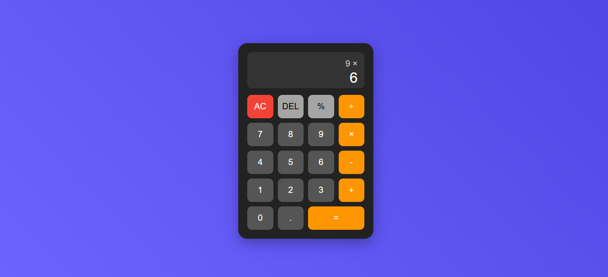

# 🧮 Build a Calculator using HTML, CSS & JavaScript

A beginner-friendly calculator project that performs basic arithmetic operations—addition, subtraction, multiplication, and division. This project is perfect for anyone looking to strengthen their foundational skills in front-end web development.

## 📚 Project Overview

This simple calculator application is built using:

- **HTML** to create the layout and structure of the calculator.
- **CSS** to style the interface and improve the visual appearance.
- **JavaScript** to handle the core logic and perform calculations.

## ✨ Features

- Basic arithmetic operations:
  - ➕ Addition
  - ➖ Subtraction
  - ✖️ Multiplication
  - ➗ Division
- Real-time input and output display
- Clear and responsive button layout

## 🧱 UI Elements

- Number buttons (0–9)
- Operation buttons (+, -, ×, ÷)
- Clear (`C`) and Equal (`=`) buttons
- Display screen to show inputs and results

## 🚀 How to Run

1. Clone or download the project.
2. Open `index.html` in your browser.
3. Start calculating!

## 🛠 Technologies Used

- **HTML5**
- **CSS3**
- **JavaScript (ES6)**

---

This project is ideal for practicing DOM manipulation, event handling, and styling interactive web components. Happy coding!
